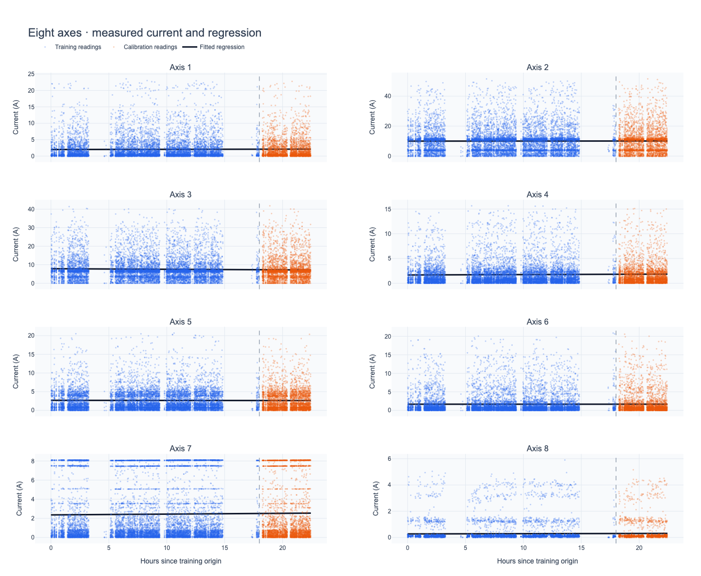
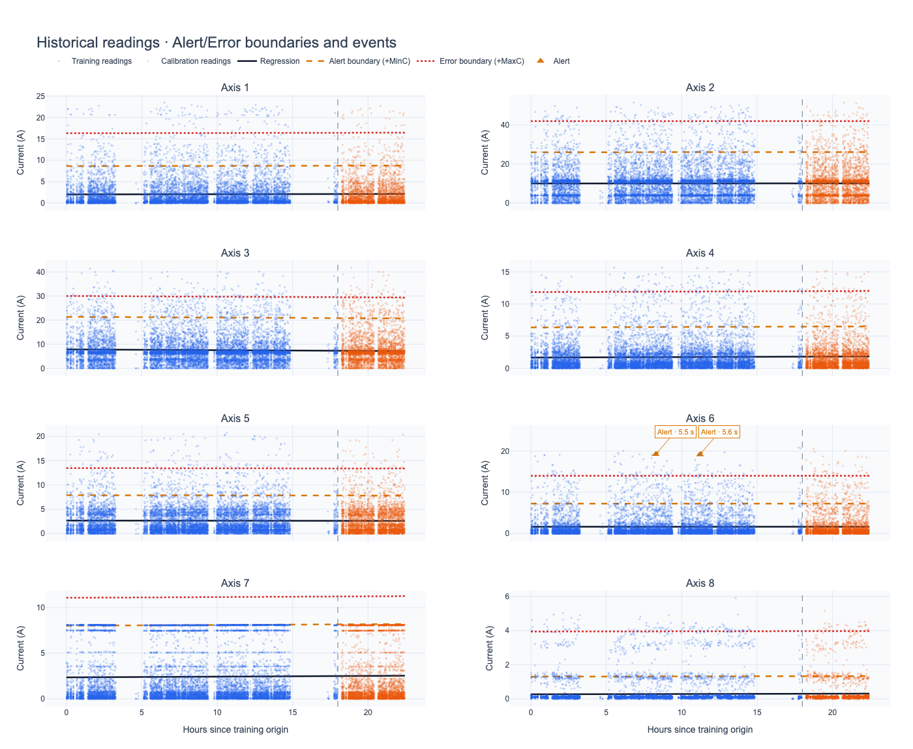
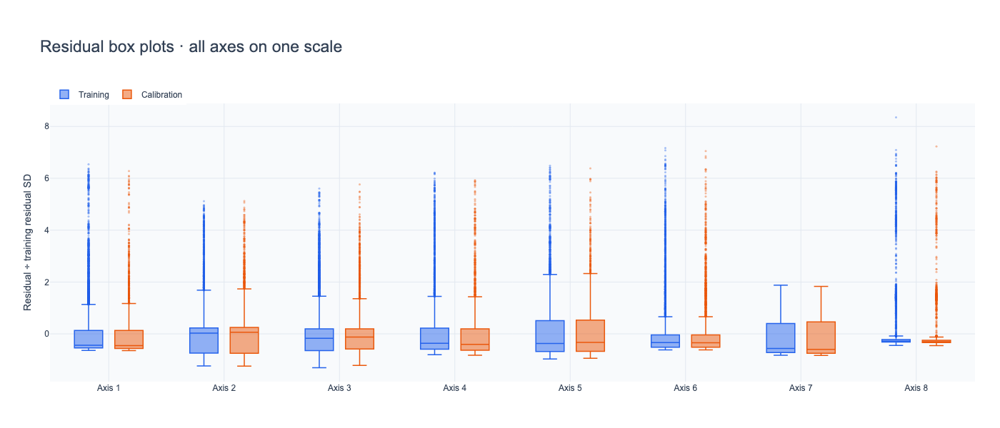
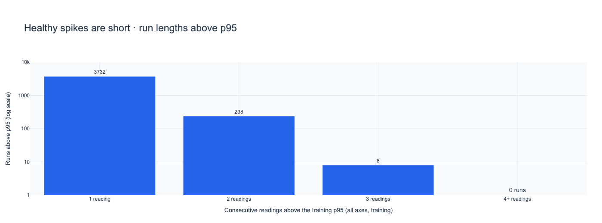
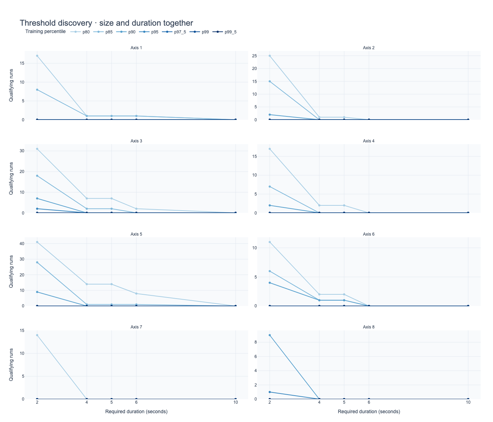
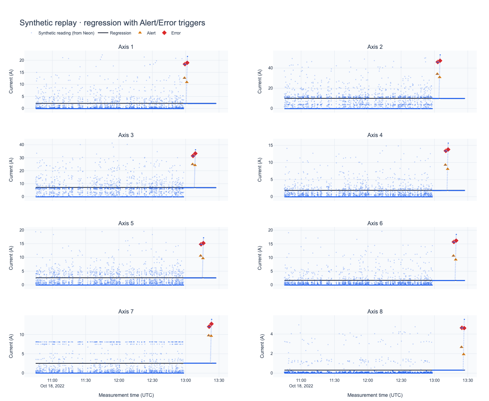
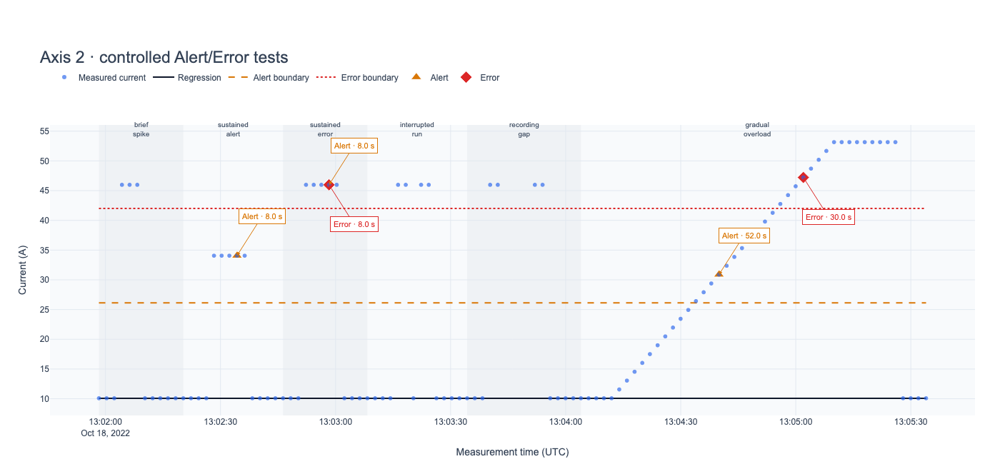

# Robot Current Monitoring with Linear Regression

| | |
|---|---|
| **Course** | CSCN8010 — Foundations of Machine Learning Frameworks |
| **Author** | Nnamdi Ikengah |
| **Student ID** | 9085175 |
| **Repository** | <https://github.com/Namypark/robot-current-alerts> |

A predictive-maintenance project. Eight linear regression models learn how much electrical
current each joint of an industrial robot normally draws. Their prediction errors (residuals) are
used to discover Alert and Error rules, which are then tested on a synthetic stream of readings
passed through a cloud PostgreSQL database.

---

## Contents

1. [Project summary](#project-summary)
2. [Results at a glance](#results-at-a-glance)
3. [Repository layout](#repository-layout)
4. [Setup](#setup)
5. [How it works](#how-it-works)
6. [Alert and Error rules](#alert-and-error-rules)
7. [Plots](#plots)
8. [Limitations](#limitations)

---

## Project summary

The dataset (`data/RMBR4-2_export_test.csv`) holds **39,672 readings** from one robot, taken about
every 2 seconds over 22.5 hours on 17–18 October 2022. Each reading gives the current, in amperes,
drawn by each of eight joints (Axis #1–#8).

The project:

1. **Pulls the training data from Neon PostgreSQL** (`robot_readings` table).
2. **Fits eight univariate linear regressions**, one per axis, with time as the only input.
3. **Analyses the residuals** with histograms, residual-over-time plots, box plots, outlier
   counts and run-length analysis.
4. **Discovers the thresholds** MinC, MaxC and T from that evidence.
5. **Generates synthetic test data** from the training data's statistics, and checks it against the
   training data with min-max normalization and z-scores.
6. **Streams the test data through Neon** reading by reading, predicts each value, and detects
   Alerts and Errors live.
7. **Logs every event** to `results/events.csv` and to the Neon `alert_events` table.
8. **Plots** the regression lines with Alert/Error markers, each labelled with its duration.

> **A note on units.** The assignment describes thresholds in kWh. This dataset records current
> (amperes) only, with no voltage, so energy cannot be calculated. All thresholds are therefore in
> **amps above the regression line**.

## Results at a glance

|                         |                                                                             |
| ----------------------- | --------------------------------------------------------------------------- |
| Alert rule              | current ≥ **MinC** amps above the line for ≥ **5 s** continuously           |
| Error rule              | current ≥ **MaxC** amps above the line for ≥ **5 s** continuously           |
| MinC                    | training 95th percentile of residuals, per axis                             |
| MaxC                    | training 99th percentile (at least MinC + 1 SD), per axis                   |
| Healthy historical data | 2 Alerts in 18 h of training, 0 in calibration, 0 Errors                    |
| Synthetic stream        | 4,840 readings through Neon; **48 / 48** test scenarios correct             |
| Events logged           | 40 (24 Alerts, 16 Errors), all from injected faults; none from healthy data |

## Repository layout

```text
.
├── LinearRegression_Alerts.ipynb       # main notebook, saved with the outputs of its last full run
├── DataStreamVisualization_Workshop.ipynb  # earlier group workshop (Neon + streaming) this builds on
├── README.md
├── requirements.txt                    # pinned dependencies for pip
├── pyproject.toml, uv.lock             # the same dependencies for uv
├── data/
│   ├── RMBR4-2_export_test.csv         # training data (also loaded into Neon)
│   └── synthetic_test.csv              # generated test stream
├── results/
│   ├── selected_thresholds.csv         # MinC, MaxC, T per axis
│   ├── model_parameters.csv            # slope and intercept per axis
│   ├── model_metrics.csv               # MAE, RMSE, R² per axis
│   ├── residual_summary.csv            # percentiles and outlier counts
│   ├── run_duration_summary.csv        # how long healthy deviations last
│   ├── threshold_comparison.csv        # threshold × duration grid
│   ├── events.csv                      # logged Alert/Error events
│   ├── model_configuration.json        # everything needed to reproduce a prediction
│   └── plots/                          # PNG charts and zoomable HTML versions
└── src/
    ├── data_collection/
    │   ├── data_collection_agent.py    # Neon connection and queries
    │   └── streaming_simulator.py      # replays a CSV one reading at a time
    ├── database-service/
    │   └── migrate_schema.py           # loads the training CSV into Neon
    └── web_ui/                         # optional live dashboard (Dash) from the workshop
```

## Setup

**Requirements:** Python 3.13, plus a Neon PostgreSQL database (the free tier is enough).

### 1. Clone and install

```bash
git clone https://github.com/Namypark/robot-current-alerts.git
cd robot-current-alerts
```

With [uv](https://docs.astral.sh/uv/) (recommended; it installs Python 3.13 automatically):

```bash
uv sync
```

Or with pip:

```bash
python3.13 -m venv .venv
source .venv/bin/activate          # Windows: .venv\Scripts\activate
pip install -r requirements.txt
```

### 2. Connect the database

Create a file named `.env` in the project root:

```text
DATABASE_URL=postgresql://<user>:<password>@<host>/<database>?sslmode=require
```

Copy the connection string from the Neon console. `.env` is git-ignored.

### 3. Load the training data into Neon (first time only)

```bash
uv run python src/database-service/migrate_schema.py create   # create robot_readings_new
uv run python src/database-service/migrate_schema.py load     # insert the 39,672 rows
uv run python src/database-service/migrate_schema.py verify   # should print MATCH
uv run python src/database-service/migrate_schema.py swap     # rename to robot_readings
```

The notebook creates its other two tables, `synthetic_test_readings` and `alert_events`, when it
first runs.

### 4. Run the notebook

```bash
uv run jupyter lab
```

Open `LinearRegression_Alerts.ipynb` and choose **Run → Run All Cells**. A full run takes about
four minutes; most of that is the streaming replay. Start Jupyter from the project root so the
relative paths resolve.

Charts are exported as PNGs with Kaleido, which needs Chrome. If Chrome isn't installed, run
`uv run python -c "import kaleido; kaleido.get_chrome_sync()"` once. Without Chrome the notebook
still runs, and the charts stay interactive only.

### 5. Optional: live dashboard

`src/web_ui/` contains a small Dash app, carried over from the data-streaming workshop. It replays
the stored readings from Neon as a live chart of all eight joints:

```bash
uv run python src/web_ui/web_ui_interface.py
```

Then open <http://127.0.0.1:8050/>. Stop it with `Ctrl+C`.

## How it works

### Regression models (Time → Axis #1–#8)

The data is split **in time order**: the first 80% (18 hours) for training and the last 20%
(4.4 hours) for calibration. Two-thirds of the readings are **idle**, with every joint at exactly
0 A while the robot is parked. Fitting through those zeros would pull each line down, and every
working reading would then look "too high". The lines are therefore fitted on **active readings
only**. Idle readings still pass through the detector, but their residual is negative, so they can
never trigger an alert.

| Axis | Intercept (A) | Slope (A per hour) | R²     |
| ---- | ------------- | ------------------ | ------ |
| 1    | 2.007         | +0.0054            | 0.0001 |
| 2    | 10.031        | +0.0020            | 0.0000 |
| 3    | 7.833         | −0.0302            | 0.0005 |
| 4    | 1.672         | +0.0076            | 0.0002 |
| 5    | 2.700         | −0.0040            | 0.0000 |
| 6    | 1.655         | +0.0003            | 0.0000 |
| 7    | 2.363         | +0.0080            | 0.0001 |
| 8    | 0.274         | +0.0013            | 0.0001 |

The slopes are almost zero and R² is about zero. Over 22 hours a healthy robot's average load does
not trend, so each line settles at that joint's typical working current. This is evidence that
there is **no drift**, not a sign that the model failed.

### Residual analysis

Residual = measured current − predicted current. Positive means "drawing more than expected".

- **Histograms:** every axis is strongly right-skewed. Normal work cycles produce short peaks far
  above the line.
- **Residuals over time:** flat bands with no upward creep from training into calibration.
- **Box plots on a common scale:** training and calibration look the same.
- **Outlier counts:** the IQR rule flags 3.6–13.5% of working readings and the 3 SD rule about
  2–3%. That is far too many to all be faults. Size alone cannot separate a fault from normal work,
  so the rules also require **duration**.

### Synthetic test data

The test stream is generated in the notebook from the training data, with a fixed seed so it is
repeatable:

- **Healthy background:** 4,000 readings made from random blocks of 30 consecutive training
  readings. This keeps the 2-second rhythm, the idle periods and the way the joints move together.
- **Injected scenarios** for every axis, each with a known correct answer:

| Scenario           | What is injected                         | Expected result          |
| ------------------ | ---------------------------------------- | ------------------------ |
| `brief_spike`      | Error-level current for 4 s              | nothing (shorter than T) |
| `sustained_alert`  | between MinC and MaxC for 8 s            | Alert                    |
| `sustained_error`  | above MaxC for 8 s                       | Alert + Error            |
| `interrupted_run`  | above MaxC, broken by one normal reading | nothing (timer resets)   |
| `recording_gap`    | above MaxC, split by a gap in the data   | nothing (timer resets)   |
| `gradual_overload` | load climbs for 60 s, then holds         | Alert, then Error        |

**Normalized and standardized against the training data:** the synthetic data never gets its own
scaler. It is min-max scaled with the training minimum and maximum, and turned into z-scores with
the training mean and standard deviation. The share of readings within ±1, ±2 and ±3 SD matches
training to within about one percentage point on most axes (largest gap 4.3 points). Means differ
by less than 0.09 SD, and the spread ratios are 1.00–1.13.

### Streaming through Neon

`StreamingSimulator` releases `synthetic_test.csv` one reading at a time, at 100× real time.
Readings are inserted into `synthetic_test_readings` in batches of 25 and **queried back from the
database**. The regression predicts the queried values and the live detector updates its timers.
The detector remembers its state between batches, so a deviation that crosses a batch boundary is
still timed correctly.

After the replay, the notebook checks that:

- the data returned by Neon matches the CSV exactly;
- the live alerts match a full recalculation;
- the logged events match an offline calculation.

## Alert and Error rules

### How the values were chosen

**1. Healthy spikes are short.** Of 3,978 training spikes above the 95th percentile, **93.8% last a
single reading** and none lasts four readings.

**2. Size and duration were tested together.** The table shows sustained runs in the healthy
calibration period, summed over all axes, for each threshold level and required duration:

| Level / T | 2 s | 4 s | **5 s** | 6 s | 10 s |
| --------- | --- | --- | ------- | --- | ---- |
| p80       | 156 | 27  | 27      | 11  | 0    |
| p85       | 82  | 5   | 5       | 2   | 0    |
| p90       | 33  | 1   | 1       | 0   | 0    |
| **p95**   | 3   | 0   | **0**   | 0   | 0    |
| p99       | 0   | 0   | 0       | 0   | 0    |

**3. The choice:**

| Setting  | Value                              | Why                                                                                                                                 |
| -------- | ---------------------------------- | ----------------------------------------------------------------------------------------------------------------------------------- |
| **MinC** | training p95, per axis             | The lowest level at which healthy data produces **no** sustained run at T = 5 s.                                                    |
| **MaxC** | training p99, at least MinC + 1 SD | Only 1 in 100 working readings gets this high, even for an instant. The floor keeps an Error clearly worse than an Alert.           |
| **T**    | 5 seconds                          | At about 2 s per reading this needs four high readings in a row, more than any healthy spike lasts. It still reacts within seconds. |

The MaxC floor matters only for **Axis 7**. That joint tops out at 8.11 A, so its 95th and 99th
percentiles are just 0.07 A apart. With the floor, an Axis 7 Error means drawing more current than
the joint has ever drawn.

| Axis | MinC (A) | MaxC (A) | T (s) |
| ---- | -------- | -------- | ----- |
| 1    | 6.64     | 14.34    | 5     |
| 2    | 16.04    | 31.93    | 5     |
| 3    | 13.55    | 22.21    | 5     |
| 4    | 4.68     | 10.17    | 5     |
| 5    | 5.21     | 10.79    | 5     |
| 6    | 5.60     | 12.36    | 5     |
| 7    | 5.65     | 8.70     | 5     |
| 8    | 1.03     | 3.67     | 5     |

If two readings are more than 5.7 s apart (three times the normal sampling gap), both timers
restart. A gap in the data is not treated as evidence of continuous overload.

### In predictive-maintenance terms

- A worn torque tube or a binding joint makes a joint **keep** drawing extra current. That is a
  sustained deviation, which is what T looks for.
- **Alert** = inspect at the next planned stop. **Error** = stop and check now.
- On healthy history the rules raised only 2 Alerts in 18 hours, both borderline. A system that
  rarely cries wolf is one that maintenance staff keep trusting.
- Axes 2 and 3 carry the heaviest loads. Over months, a slope that starts climbing on those axes
  would be the early sign of wear.

## Plots

**Eight regression lines** (training in blue, calibration in orange):



**The chosen rules on the historical data.** The dashed and dotted lines are the Alert and Error
boundaries; the only two events in 22.5 hours (both Alerts on Axis 6) are marked with their
durations:



**Residual box plots** (all axes on one scale):



**How long healthy spikes last:**



**Threshold discovery** (qualifying runs per percentile and duration):



**Synthetic stream through Neon**, with the regression lines and Alert/Error triggers:



**Axis 2 close-up.** Every event is labelled with its duration:



All eight per-axis charts, the residual histograms and residuals-over-time are in
`[results/plots/](results/plots/)`.

## Limitations

- **No fault labels.** The data contains no confirmed failures, so precision and recall cannot be
  measured.
- **Calibration helped choose the rules**, so it is not an independent test set.
- **The synthetic background reuses training data.** It tests that the rules behave correctly, not
  how accurate they are on a real fault.
- **One day is too short to see wear.** The models are a baseline. Slow degradation would need
  weeks of data and regular refitting.
- **Edge case:** two high readings separated by a near-maximum sampling gap can meet T. Also
  requiring a minimum number of readings would close this gap.
